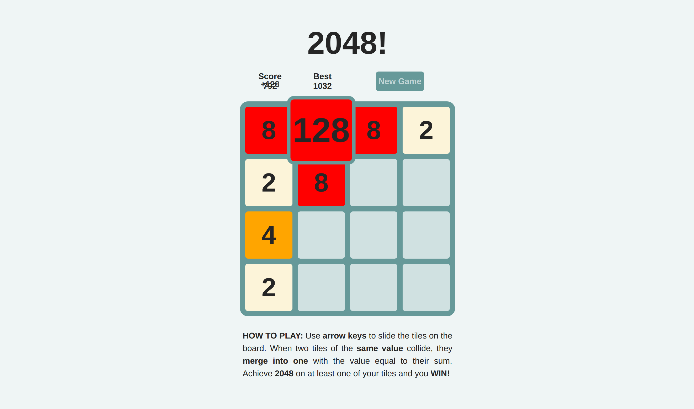
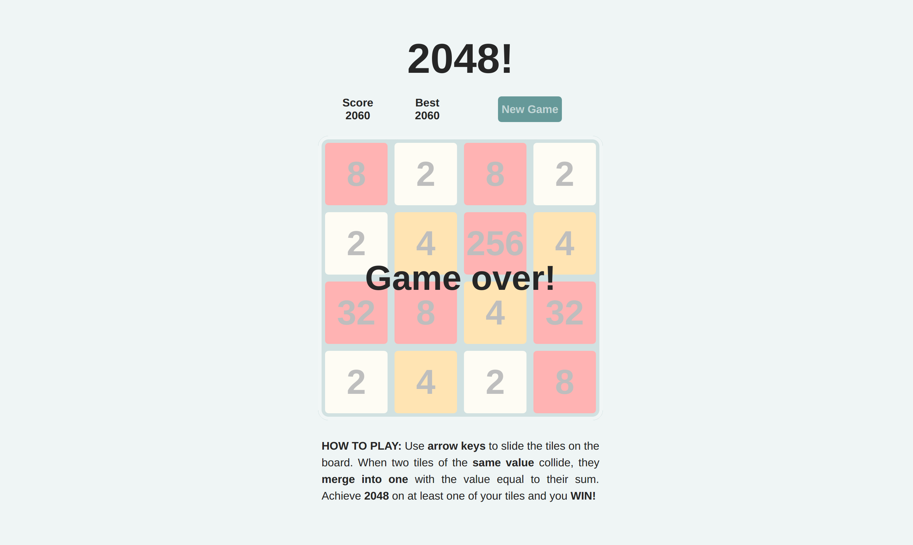

# 2048

[2048 live][github]

[github]: https://knasirov.github.io/2048/

2048 is a clone of the popular logic game with the same name, which is based on Threes. Players slide the tiles on the board to join tiles of the same number to achieve 2048.

## Features

- Current and Best scores
- Smooth sliding of the tiles
- Zooming effect when tiles merge
- Newly added score fading out from current score

## Gameplay

2048 is player on a 4x4 grid with numbered tiles. Players use arrow keys to slide the tiles on the board. At every turn, a new tile with a value of 2 or 4 (with the probability of 90% and 10%, respectively) appears at one of the empty tiles on the board. While sliding, if two tiles of the same value collide, they merge into one with the value equal to their sum. Every tile can merge only once per move. To win, player must have a tile with the value of 2048 on the board.

## Project Design

2048 was built using vanilla JavaScript, jQuery, and CSS3. This project makes heavy use of asynchronous functions and callbacks to give smooth animation effects. In addition to minified jQuery, [Transit](http://ricostacruz.com/jquery.transit/) was used to take advantage of smooth transformation effects. Best score is stored on players browser using LocalStorage.
